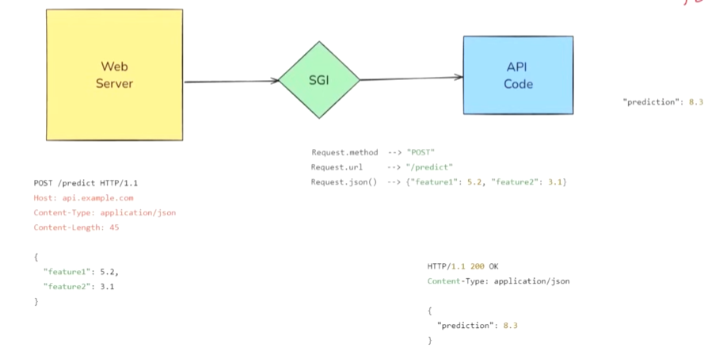

## Why Fast API is fast to run?

# How API works?

There are 2 important components of an API: **API code** and **Web Server**.
- **Web Server** acts as listener, where it constantly checks for any kind of incoming requests. In the above picture, when we request for an API Fetch which is in the form of a **HTTP** request for some kind of Feature then it automatically finds all the necessary things it needs to find and then forwards it to the **API Code**.
- The problem over here is **HTTP Request** can't be read by **Python** directly, so to solve this problem we use a **SGI** (**Service Gateway Interface**). What it does is, it converts the **HTTP** request to a **Python** understandable form which is mostly **JSON** (**JavaScript Object Notation**) and upon that the **API code** will be able to extract all the necessary things to process the request and send it back to the **Web Server**. While sending it back, it again goes through the **SGI** so that **Web Server** would be able to get in its own readable format. And the **Web Server** will send this fully packaged request back to the Client.

## How FastAPI is different from Flask (A common module previously used to work upon API)?

- **Flask** has the same architecture but in the **SGI** space it uses a different version of **SGI** developed by the name **Werkzeug** which is a **WSGI** (**Web Server Gateway Interface**). This is synchronous in nature i.e. upon a time only one request can be worked upon, all other requests are blocked until the other request has completed. It uses **Gunicorn** as a web server which has the same issues as that of the **SGI** they use, it's slower, one request is handled at a time, I/O wait time, Performance Issues and can create latency issues in modern application.

- Now coming to **FastAPI** it uses an Asynchronous version of **SGI** developed by the name **Starlette** which is an **ASGI** (**Asynchronous Server Gateway Interface**). This can handle multiple requests at a given amount of time. We use **Uvicorn** as web server, it has high performance capability and asynchronous processing. You can also use **async** and **await** functions to handle requests. Mostly it is used in cases where either depends upon any other requests or there is a long wait for the process to get complete, upon using this we can rectify in the **API Code** that it can process other requests when this one is on hold.

## Why FastAPI is fast to code?

- Automatic Input Validation (has inbuilt feature of Pydantic)

- Auto-Generated Interactive Documentation (has inbuilt document generation and thus you dont need to manually update everything about your code)

- Seamless Integration with Modern Ecosystem (ML/DL Libraries, OAuth, JWT, SQL Alchemy, Docker, etc)