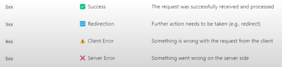
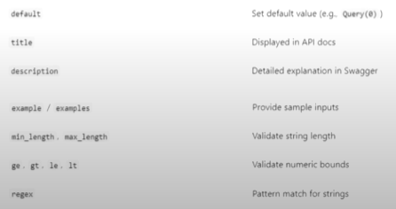

# Path Params:
- Path parameters are dynamic segments of a URL path used to identify a specific resource.
- For easy understanding this acts like a filter that you can use on your endpoints such tha certain items that you don't need to show or want to only access a specific data.
- - For example - 
    localhost:8000/view/3
    This is domain/this is your endpoint/this is your path param

# Path():
- This is a inbuilt function of FastAPI which is used to provide metadata, validation rules, and documentation hints for path parameters in your API endpoints.     

# HTTP Status Code:
- As told earlier that our client and web server work upon a 2 way communication and is based on the HTTPs protocol. Upon giving back the data to the client in its response, the web server attaches a 3-digit number called as HTTP Status Code to indicate the result of a client's request.
- They help the client( browser, frontend, mobile app, etc) understand:
    - whether the request was successfull.
    - whether something went wrong.
    - and what kind of issue occured (if any).

# HTTP Exception():
- Another problem arises over here that, upon accessing any kind of invalid data, as we have written a test case that if the data is not available then it would give the specific JSON, but what actually should have been done is return the HTTP Status code 400, which means that the specific data is not found.
- To work upon this issue we use HTTP Exception, which is a inbuilt function of FastAPI. It is used to reutn custom HTTP Error responses when something goes wrong in your API.
- Instead of returning a normal JSON or crashing the server, you can gracefully raise an error with:
    - a proper HTTP status code(like 404, 403, 402 ,etc).
    - a custom error message.
    - (optional) extra headers.

# Query Parameter:
- These are optional key-value pairs appended to the end of a URL used to pass additional data to the server in an HTTP request. They are typically employed for operations like filtering, sorting, searching, and pagination, without altering the endpoint path itself.
- for Example- /patients?city=Delhi&sort_by=age
    - the ? marks the start of the query parameters
    - Each parameter is a key-value pair : key=value
    - Multiple parameters are separated by &

# Query():
- It is a utlility function provided by FastAPI to decalre, validate, and document query parameters in your API endpoints.  
      

