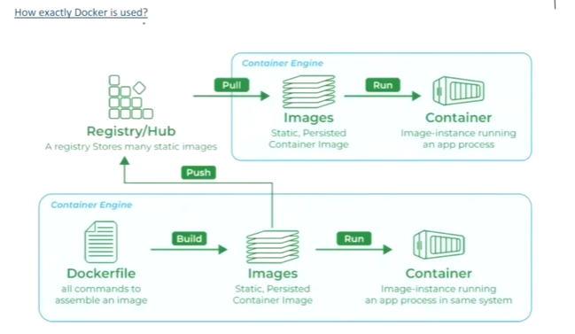

# Docker
- **Docker** is a platform designed to help developers build, share and run container applications.

## Why do we need Docker?
- **Consistency Across Environments**:
    - **Problem**: Applications often behave differently in development, testing and production environments due to variations in configurations, dependencies, and infrastructure.
    - **Solution**: **Docker containers** encapsulate all the necessary components, ensuring the application runs consistently across all environments.
- **Isolation**:
    - **Problem**: Running multiple applications on the same host can lead to conflicts, such as dependency clashes or resource contention.
    - **Solution**: **Docker** provides isolated environments for each application, preventing interference and ensuring performance.
- **Scalability**:
    - **Problem**: Scaling applications to handle increased load can be challenging, requiring manual intervention and configuration.
    - **Solution**: **Docker** makes it easy to scale applications horizontally by running multiple container instances, allowing for quick and efficient scaling.  

## How exactly is Docker used?

### Docker/Container Engine: 
- **Docker Engine** is the core component of the **Docker** platform, responsible for creating, running, and managing Docker containers. It serves as the runtime that powers Docker's containerization capabilities.
- Components of **Docker Engine**:

    - **Docker Daemon** (**dockerd**):
        - **Function**: The Docker Daemon is the background service running on the host machine. It manages Docker objects such as images, containers, networks, and volumes.
        - **Interaction**: It listens for Docker API requests and processes them, handling container lifecycle operations (start, stop, restart, etc.) 

    - **Docker CLI** (**docker**):
        - **Function**: The **Docker Command Line Interface** (CLI) is the tool that users interact with to communicate with the Docker daemon.
        - **Usage**: Users run Docker commands through the CLI to perform tasks like building images, running containers, and managing Docker resources.

    - **REST API**:
        - **Function**: The **Docker REST API** allows communication between Docker CLI and the Docker daemon. It also enables programmatic interaction with Docker.
        - **Usage**: Developers can use the API to automate Docker operations or integrate Docker functionality into their applications.

### Docker Images:
- A **Docker image** is a lightweight, stand-alone, and executable software package that includes everything needed to run a piece of software, such as the code, runtime, libraries, environment variables, and configuration files. Images are used to create Docker containers, which are instances of these images.
- Components of a **Docker Image**:
    - **Base Image**: The starting point for building an image. It could be a minimal OS Image like **Alpine**, a full-fledged OS like **Ubuntu**, or even another application image like **Python** or **Node**.
    - **Application Code**: The actual code and files necessary for the application to run.
    - **Dependencies**: Libraries, frameworks, and packages required by the application.
    - **Metadata**: Information about the image, such as environment variables, labels and exposed ports.
- **Docker Image Lifecycle**:
    - **Creation**: Images are created using the `docker build` command, which processes the instructions in a Dockerfile to create the image layers.
    - **Storage**: Images are stored locally on the host machines. They can also be pushed to and pulled from Docker registries like Docker Hub, AWS ECR, etc.
    - **Distribution**: Images can be shared by pushing them to a Docker registry, allowing others to pull and use the image.
    - **Execution**: Images are executed by running containers, which are instances of these images. 

### Dockerfile:
- A **Dockerfile** is a text file that contains a series of instructions used to build a **Docker image**. Each instruction in a **Dockerfile** creates a layer in the image, allowing for efficient image creation and reuse of layers. **Dockerfiles** are used to automate the image creation process, ensuring consistency and reproducibility.

### Docker Container:
- A **Docker container** is a lightweight, portable, and isolated environment that encapsulates an application and its dependencies, allowing it to run consistently across different computing environments. Containers are created from **Docker Images**, which are immutable and contain all the necessary components for the application to run.

### Registry:
- It serves as a storage service that stores and distributes **Docker Images**. It acts as a repository where users can push, pull, and manage **Docker Images**.
- **Docker Hub** is the most well-known public registry, but private registries can also be set up to securely store and manage images within an organization.
- Key components of a **Docker Registry**:
    - **Repositories**: A repository is a collection of related Docker images, typically different versions of the same application. Each repository can hold multiple tags, representing different versions of an image.
    - **Tags**: Tags are used to version images within a repository.

